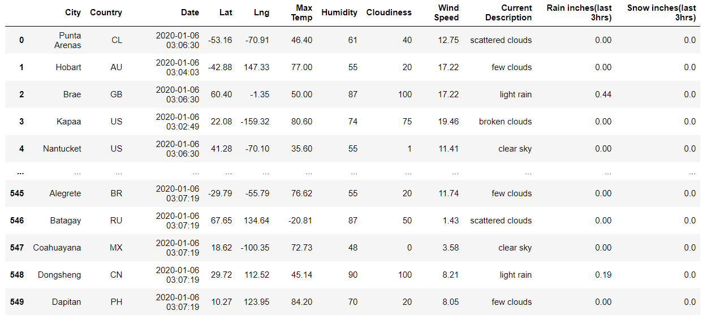
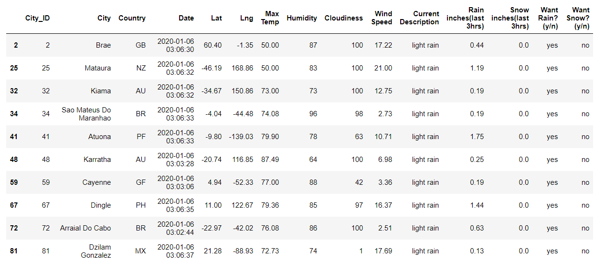
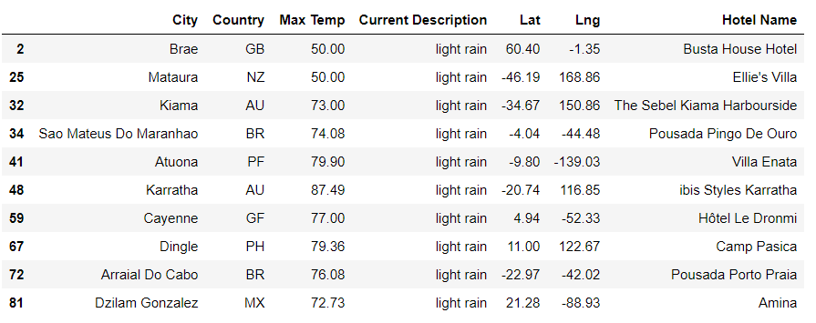
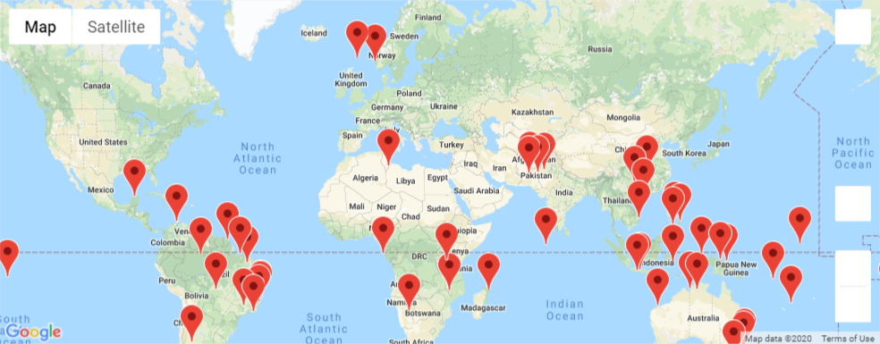
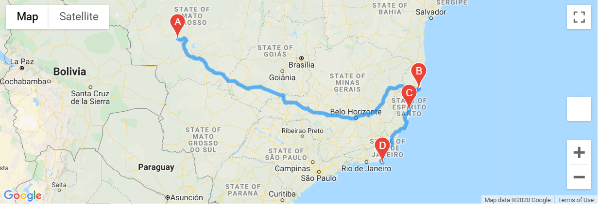
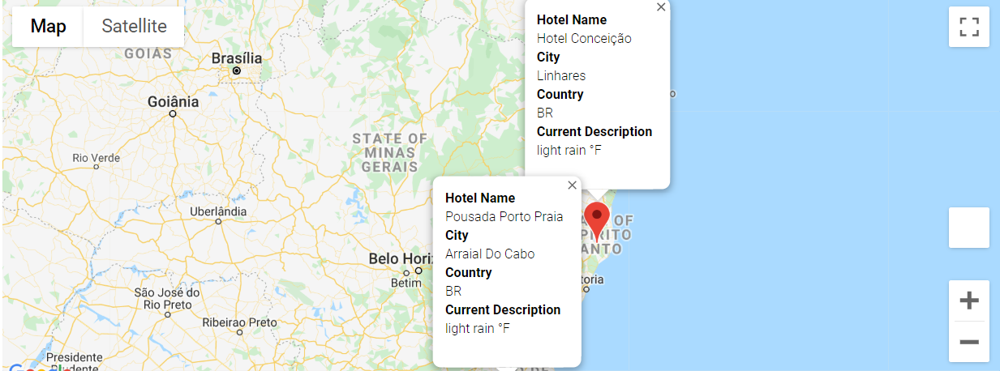

# World_Weather_Analysis

# Module 

In this module, we analyzed, vizualized and statistically graphed the weather data for a potentail travel company. We used Pandas, Matplotlib, and SciPy libraries. We used new python libraries, retived data from APIs, parced JSON data, used the try and except balcoks to resolve errors, created scatter plots using the Matplotlib library, and applied styes and features to a plot.In addtion, we created heatmaps, added markers using Google Maps API. 

# Challenge

The goal of this challenge is to help John with the beta testers for the PlanMyTrip app. The beta testers include creating a weather description to the dataframe and to the map plotted. This will allow for customers to know what the weather is to the location they travel. Next, we created a search criteria to indicate if it is raining or snowing for customers who are making the travel decisions in real time. Lastly, wecreated a map for customers that shows them the direction for their travel itinerary. 

# Part 1

We connected to an API (openweathermap) so that customers will know the weather in the cities when they click on the pop-up maker. We generated 1500 random coordinates (latitudes and longitudes). Using the try-except block, we retrieved the amount of rain and snow fall for three hours from the JSON data via API. We also then added the amount of rainfall or snowfall within the last hour. In the data, we found that 55 cities reported rain and 26 reported snow at the time the API was pulled.This data was then extrated in a csv file for use for part 2.

# Part 2

Using the data we created in part one, we created a new column with specific criteria. This way the customers can filter the DataFrame using input statement based on the temperature range and whether or not it is raining or snowing. We had our customers narrow their search based on temperature and precipitation. Based on our customer selected the dataframe below was the output.

The map below shows the hotel names we added using another API. Using the new API, we found the city names and created the dataframe below.

In addition, we created a data frame to help us map with a pop-up marker for each city. It included Hotel name, city, country, current weather description, and max temperature.

Below is the map layer we created displayed each city that met the criteria. 

Lastly, we created a directions layer Google map that shows the direction between multiple cities. We randomly selected four cities that were close together on our map. From there we created a directions layer map using gmaps. 

In addition, we created a marker for each of the four cities that were randomly selected based on proximity.

